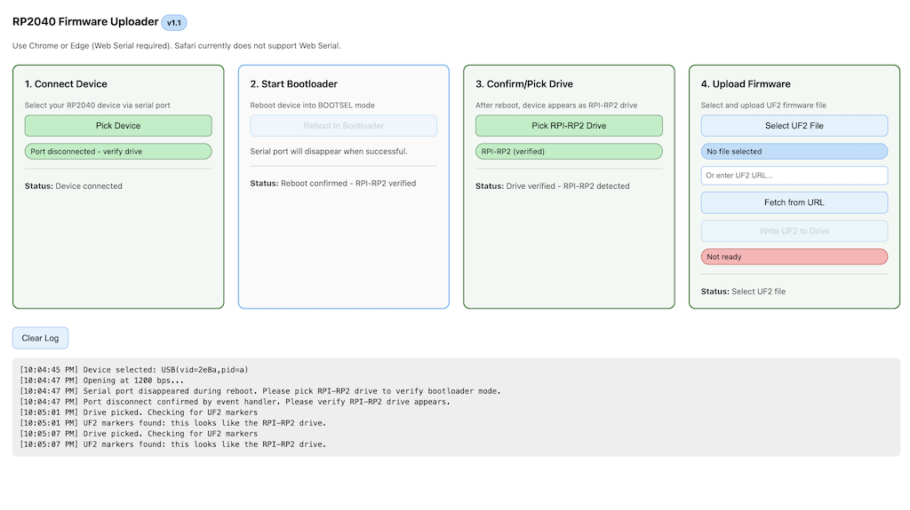

## RP2040 Web Uploader v1.2 (no BOOT/SEL access)

This page lets you reboot an RP2040 into BOOTSEL (UF2) mode and flash a `.uf2` file directly from your browser. It is useful after assembly when the hardware BOOT/SEL buttons are not accessible.

### Requirements
- **Browser**: Chrome or Edge (desktop). Safari is not supported.
- **APIs**: Web Serial and File System Access (automatically available in Chrome/Edge).
- **Context**: Prefer `https://` or `http://localhost/` so the File System Access API works fully.

### Quick Start
1. Open `rp2040-uploader.html` in Chrome/Edge (double-click, or drag it into a new tab).
2. **Step 1 - Connect Device**: Click **Pick Device** and select your RP2040 serial device.
3. **Step 2 - Start Bootloader**: Click **Reboot to Bootloader**. This uses the 1200‑bps touch method to reboot the device into BOOTSEL mode. The serial port will disappear when successful.
4. **Step 3 - Confirm/Pick Drive**: After reboot, click **Pick RPI-RP2 Drive** and select the root of the RPI‑RP2 volume that appears on your computer.
5. **Step 4 - Upload Firmware**: 
   - Click **Select UF2 File** (or enter a **URL** and click **Fetch from URL**).
   - Click **Write UF2 to Drive**. The board will reboot when the copy completes.

**Alternative**: After **Step 2**, if you prefer to drag and drop manually, you can skip steps 3-4. Once the RPI-RP2 drive appears on your computer, simply drag your `.uf2` file onto the drive - it will automatically reboot when the file is copied.

### Notes
- This tool does not require hardware BOOT/SEL access, but your current firmware must support the **1200‑bps touch** reset convention.
- Works entirely in the browser; no drivers or installs are required on supported OSes.
- The interface uses color coding: **Green** = active/completed step, **Blue** = available step, **Grey** = disabled step.

### Troubleshooting
- "Web Serial not available": Use Chrome/Edge (desktop). Some managed environments disable it.
- Drive/UF2 write fails on macOS: System Settings → Privacy & Security → Files and Folders → allow Chrome/Edge access to **Removable Volumes**.
- Windows: If Controlled folder access is enabled, allow Chrome/Edge or temporarily disable that protection.
- If the RPI-RP2 drive isn’t detected, make sure you picked the drive’s root and that the device actually rebooted into BOOTSEL.

