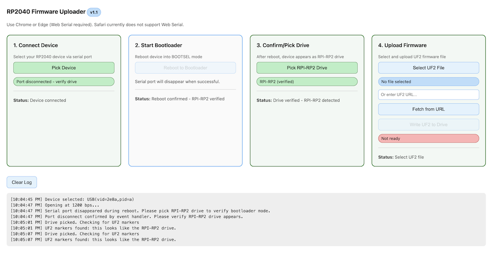
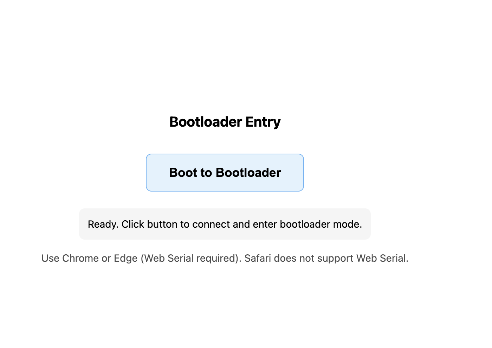

## RP2040 Web Uploader v1.2 (no BOOT/SEL access)

This page lets you reboot an RP2040 into BOOTSEL (UF2) mode and flash a `.uf2` file directly from your browser. It is useful after assembly when the hardware BOOT/SEL buttons are not accessible.

**Important**: The board must already run firmware that supports the 1200 bps "touch" method (e.g., CircuitPython, Arduino with native USB). Blank boards or boards without this support require hardware BOOTSEL button access.

### Requirements
- **Browser**: Chrome or Edge (desktop). Safari is not supported.
- **APIs**: Web Serial and File System Access (automatically available in Chrome/Edge).
- **Usage**: Simply open the HTML file directly in your browser (double-click or drag to browser tab).

### Quick Start
1. Open `rp2040-uploader.html` in Chrome/Edge (double-click, or drag it into a new tab).
2. **Step 1 - Connect Device**: Click **Pick Device** and select your RP2040 serial device.
3. **Step 2 - Start Bootloader**: Click **Reboot to Bootloader**. This uses the 1200‑bps touch method to reboot the device into BOOTSEL mode. The serial port will disappear when successful.
4. **Step 3 - Confirm/Pick Drive**: After reboot, click **Pick RPI-RP2 Drive** and select the root of the RPI‑RP2 volume that appears on your computer.
5. **Step 4 - Upload Firmware**: 
   - Click **Select UF2 File** (or enter a **URL** and click **Fetch from URL**).
   - Click **Write UF2 to Drive**. The board will reboot when the copy completes.

### Alternative: Just Boot (Simpler)

For a minimal approach, use `just_boot.html`. This tool only triggers bootloader entry via the 1200-bps touch method. After the device reboots, you manually drag the `.uf2` file to the mounted drive.

**Works with**: RP2040 and SAMD21 devices.

**Usage**:
1. Open `just_boot.html` in Chrome/Edge.
2. Click **Boot to Bootloader** and select your device.
3. Wait for the bootloader drive to appear (RPI-RP2 for RP2040, or your SAMD21 bootloader drive).
4. Manually drag your `.uf2` file to the drive.

---

### Notes

- Works entirely in the browser; no drivers or installs are required on supported OSes.
- The interface uses color coding: **Green** = active/completed step, **Blue** = available step, **Grey** = disabled step.

### Troubleshooting
- "Web Serial not available": Use Chrome/Edge (desktop). Some managed environments disable it.
- Drive/UF2 write fails on macOS: System Settings → Privacy & Security → Files and Folders → allow Chrome/Edge access to **Removable Volumes**.
- Windows: If Controlled folder access is enabled, allow Chrome/Edge or temporarily disable that protection.
- If the RPI-RP2 drive isn’t detected, make sure you picked the drive’s root and that the device actually rebooted into BOOTSEL.

